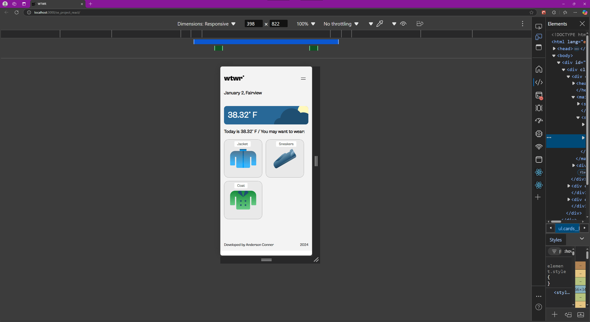
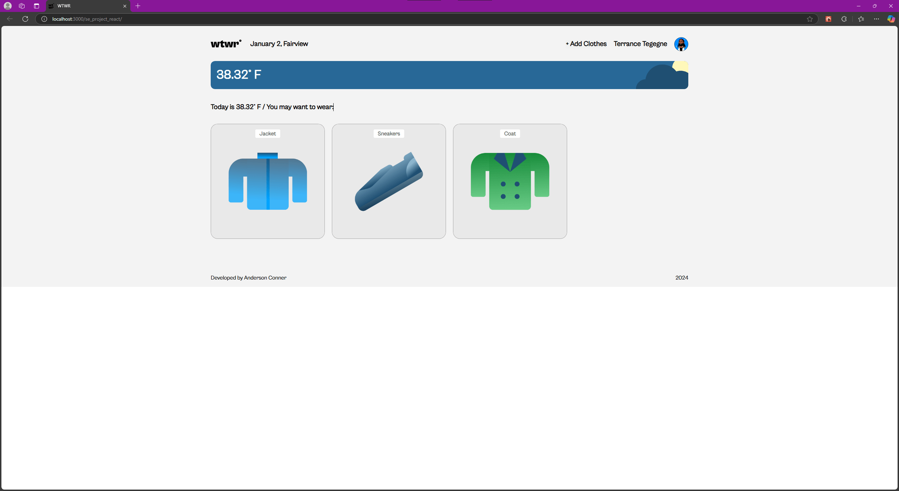

# WTWR (What to Wear?)

## About the project

The idea of the application is pretty simple - we make a call to an API, which then responds with the daily weather forecast. We collect the weather data, process it, and then based on the forecast, we recommend suitable clothing to the user.

## Links

- [Figma Design](https://www.figma.com/file/DTojSwldenF9UPKQZd6RRb/Sprint-10%3A-WTWR)
- [Backend](https://github.com/AndersonConne/se_project_express)

## Technologies

This is my first project using React. It uses dynamic functional components for use in the future. The main technologies I used was API requests from a backend, React Hooks, and basic markup and styles.

## Screenshots

